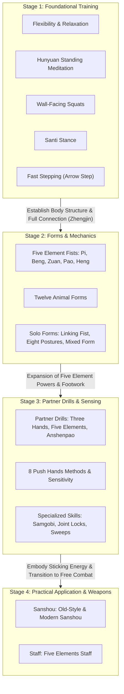

## 📌 Yearly Milestones

### Year 1: Foundation & Mechanics
- Become familiar with the basic stances and body mechanics (structure) of Xingyiquan.
- Build solid basic physical fitness and a strong lower-body root.

### Year 2: Elastic Power & Sensitivity
- Learn the fundamentals of Xingyiquan explosive power (Fajin) that bursts forth with the entire body connected as one.
- Begin pre-arranged sparring and free push hands (Tuishou) to lightly exchange force with training partners.

### Year 3+: Mastery & Free Combat
- Complete all hand forms and solo extended routines (Taolu).
- Embody martial applications to deliver power and subdue opponents through sparring and practical combat (Sanshou).
- Develop self-correction ability to independently identify and fix one's own incorrect movements.
- Prepare for the completion / graduation ceremony.

### Post-Graduation
* Acquire advanced arts and internal skills through continued exchange with the master and senior brothers in Korea:
  * Advanced Arts: Baguazhang, Taijiquan, Xingyi Sword, Bagua Sword, Taiji Sword, etc.
* Gain qualification to teach and guide others.

---

## 1. Foundational Training

- **Flexibility & Relaxation** - Stretching that facilitates Xingyiquan-style relaxation (removing unnecessary tension) and gently opens stiff joints and ligaments.
- **Hunyuan Posture / Standing Meditation** - Standing still as if hugging a large tree or a round exercise ball, erecting the spinal centerline (Zhongzheng) and turning the whole body into an elastic unit like a round rubber ball.
- **Wall-Facing Squats** - Squats performed with the nose and knees right up against a wall, training to erect the spine without arching the lower back, fold the hip crease (Kua), build a solid lower-body root, and further recognize the body's center.
- **Santi Stance / Trinity Posture** - The core engine from which all Xingyiquan power erupts. The most important standing meditation that places 70–80% of body weight on the rear foot and binds the whole body into one like a tautly drawn bowstring.
- **Fast Stepping / Arrow Step** - Xingyiquan's signature advancing step that strongly springs off the ground with the rear foot to shoot the entire body forward like a flying arrow.

---

## 2. Hand Forms & Mechanics

### 2-1. Movements

#### Five Element Fists
- **Splitting Fist (Piquan / Metal)** - A striking and blocking fist with heavy downward falling force, like an axe chopping down into firewood. (Lung conditioning)
- **Crushing Fist (Bengquan / Wood)** - Powerful penetrating force that strikes and drills straight through the front like an arrow released from a bowstring or a cannonball. (Liver conditioning)
- **Drilling Fist (Zuanquan / Water)** - An upward drilling thrust that spirals upward like a spring surging from the ground, digging from below into the opponent's chin and centerline. (Kidney conditioning)
- **Cannon Fist (Paoquan / Fire)** - Explosive expanding power where both hands open and close—one hand blocking while the other strikes upward diagonally like an exploding cannonball. (Heart conditioning)
- **Crossing Fist (Hengquan / Earth)** - A spiraling horizontal energy that shifts the central axis like a rolling log, sweeping aside the opponent's punch to penetrate and bounce them off. (Spleen conditioning)

#### Twelve Animal Forms
- **Dragon** - A spiraling takedown that twists the torso and spine to penetrate, lift, and throw, just like a dragon surging through the clouds.
- **Tiger** - Fierce downward and forward destructive power that pounces, tears, and pushes with both hands, like a ferocious tiger ambushing prey.
- **Monkey** - Agile maneuvering to shrink the body small like a monkey, swiftly grabbing and coiling the opponent's arms while targeting vital spots.
- **Horse** - Charging power that throws the entire body forward to ram and blow the opponent away, like a horse rearing its front hooves and galloping.
- **Water Strider / Alligator** - Rotational power that floats the body as if gliding across water, penetrating into the opponent's blind angle (flank) and sweeping them away.
- **Rooster** - Springing elasticity that raises the head and knees to stomp and kick the opponent's legs while pecking like a fighting rooster.
- **Sparrowhawk** - Penetrative power that folds its wings to dart through narrow forest gaps, closing the body to dive under the opponent's center and flip them over.
- **Swallow** - A technique that skims low across the water surface like a swallow, surging upward to snatch and lift the opponent's lower body.
- **Snake** - Flexible penetrating technique that lowers the body to slip under the opponent's armpits and blind angles, like a snake crawling through the grass.
- **Ostrich / Large Bird** - Expansive power that swings both arms wide like flapping large wings, shaking and collapsing the opponent's balance from side to side.
- **Eagle & Bear Combined** - The highest-level technique unifying offense and defense into one by combining the heavy downward defense of the Bear with the sharp snatching of the Eagle.

### 2-2. Core Principles
- **Eye Focus / Vision** - Method of securing visual field by placing gaze in the sequence of fist, elbow, shoulder, and opponent's eyes without losing track of their entire centerline.
- **Footwork** - Foot movements that maintain balance without losing stability, including stationary step (staying foot), follow step (trailing foot), pushing step (sliding foot), and lively step (free agility).
- **Martial Application** - Gaining real-world combative mechanics—striking, locking, and throwing—beyond the external appearance of movements.
- **Whole-Body Structural Power (Zhengjin)** - The core structural system that aligns the spine, joints, and fascia according to postural principles, locking the entire body into a single elastic unit from head to soles.
- **Body Mechanics & Postural Principles (Shenfa Yaojue)** - Essential assembly guidelines—such as suspending the crown, sinking shoulders and dropping elbows, hollowing chest and plucking back, centering the tailbone, and folding the hip crease—to remove stiff tension (crude force) and align the whole body into a perfect spring structure.

---

## 3. Solo Extended Forms

- **Advancing & Retreating Linking Fist** - The foundational form weaving the Five Element fists into forward and backward flowing combinations to learn smooth transitions and continuous offensive/defensive flow.
- **Eight Postures Form** - Intermediate form training the concentration of internal power and combination of diverse forces through 8 core techniques.
- **Mixed Postures Form** - An advanced, comprehensive form freely blending key techniques of the Five Elements and Twelve Animals to cover all realistic combat variations.

---

## 4. Partner Pre-arranged Drills

- **Piquan Sparring** - Foundational sparring exchanging the offense and defense of Splitting Fist to master distance management and deflecting incoming force at the point of contact.
- **Three Hands Cannon** - The fundamental partner drill mastering the 3 core methods of receiving, striking, and taking down without losing sticky contact with the opponent.
- **Five Elements Cannon** - Pre-arranged sparring exchanging the generating and overcoming cycles of the 5 Five Element techniques to handle clashes of force.
- **Five Flowers Cannon** - Applied dynamic sparring that neutralizes the opponent's attack at faster, multi-dimensional angles and immediately executes explosive power.
- **Body-Pacifying Cannon (Anshenpao)** - A long-sequence pre-arranged combat routine compiling Five Elements and Twelve Animals techniques, perfecting a complete full-body defense system prior to free sparring.

---

## 5. Push Hands (Push Hands - Sensing & Control)

* **Single Push Hands** - Foundational push hands matching one hand to read the direction of the opponent's force and collapse their center.
* **Double Push Hands** - Push hands matching both hands, maintaining full-body connection while exchanging offensive and defensive pressures.
- **Eight Push Hands Methods** - Sensitivity training (including Single Push Hands, Double Push Hands, and Drills #2, #3, #5, and #8) to touch forearms, read the opponent's force direction (Listening Power / Tingjin), stick closely (Adhering Power / Zhanjin), and break their balance.

---

## 6. Practical Free Combat (Sanshou)

- **Old-Style Sanshou** - Three practical combat applications taught by my master in the early days of the research association.
- **Modern/Advanced Sanshou** - New, practical Xingyiquan combat methods researched and developed by my master.

---

## 7. Weapons

- **Staff / Five Elements Staff** - Weapons training using a wooden staff as an extension of one's arms to develop Five Element power release, long-range distance awareness, and martial courage.

---

## 8. Specialized Techniques

- **Grappling & Joint Locks (3 Methods)** - Three essential joint-locking techniques to easily subdue opponents by twisting and bending joints without requiring immense physical force.
- **Lower-Body Control (4 Methods)** - Lower-body takedown skills to hook, step on, kick, and wrap around the opponent's legs to collapse them.
- **Three Clashing Forearms (Samgobi)** - Essential close-quarters wrestling skill clashing forearms at ultra-close range to contest the centerline and central balance (Zhongzheng).
- **Blocking Drilling Fist** - A defensive technique that deflects an incoming straight punch upward with a spiraling motion, immediately transitioning into a counterattack (such as connecting to Push Hands Drill #2).
- **Breakfalls / Safe Landing** - Essential safety skills to disperse impact across the entire body when thrown or knocked down, preventing injury.

---

## 📊 Curriculum Roadmap

